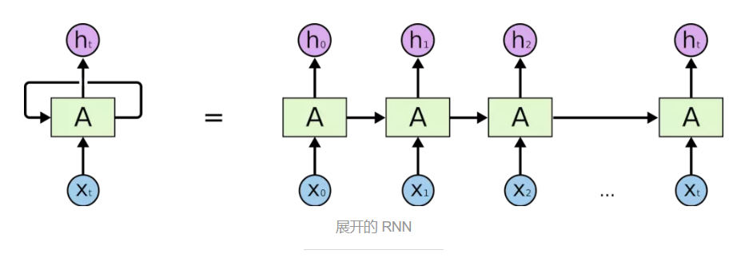
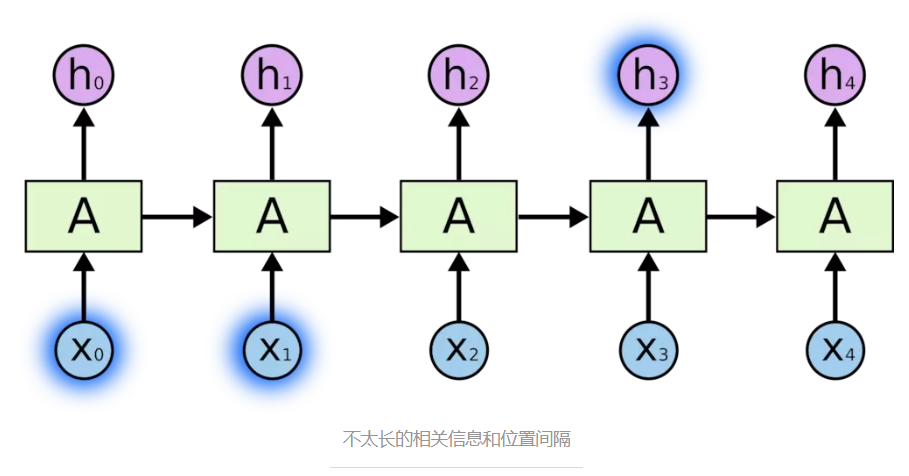
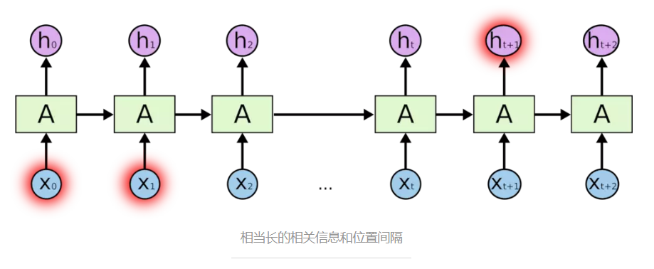
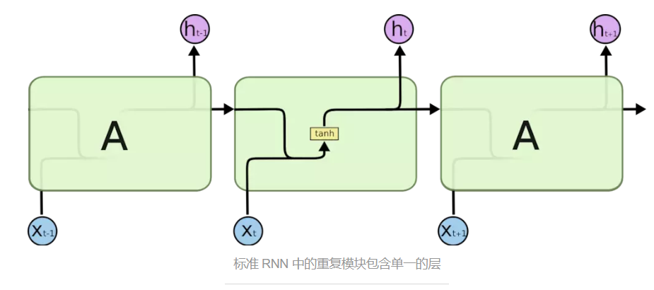
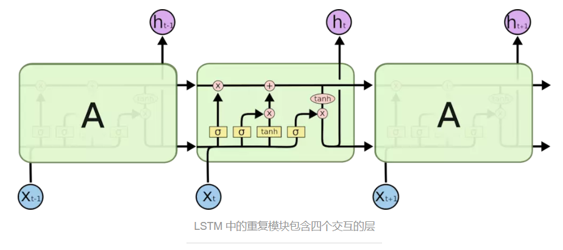
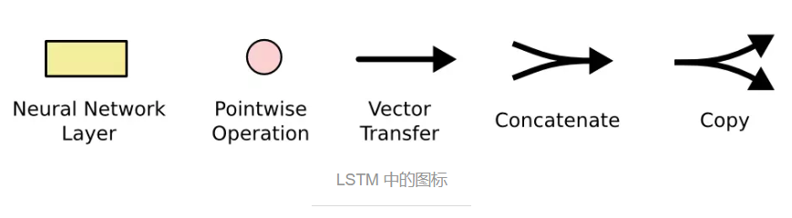
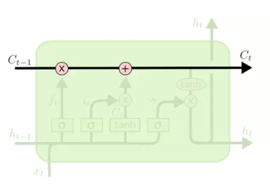
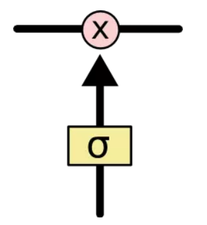
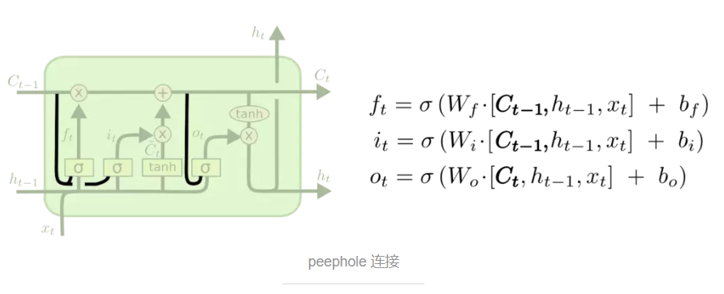
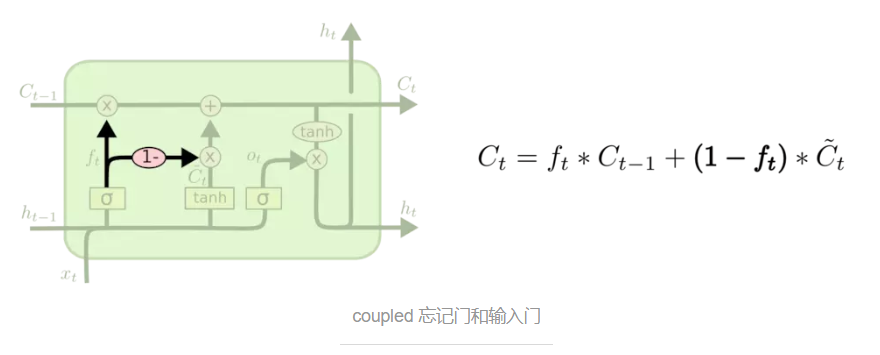

# 一文带你理解LSTM网络

> csdn：https://blog.csdn.net/qq_36645271
>
> github：https://github.com/aimi-cn/AILearners
>
> <u>本文翻译自[Christopher Olah](http://colah.github.io/posts/2015-08-Understanding-LSTMs/)的博客，另外加入了一些自己的理解</u>
>
> <u>本文的翻译参考了朱小虎Neil的翻译，链接：<https://www.jianshu.com/p/9dc9f41f0b29></u> 

***

## 循环神经网络(Recurrent Neural Networks)

人类并不是每时每刻都从一片空白的大脑开始他们的思考。在你阅读这篇文章时候，你都是基于自己已经拥有的对先前所见词的理解来推断当前词的真实含义。我们不会将所有的东西都全部丢弃，然后用空白的大脑进行思考。我们的思想拥有持久性。比如让我们从头唱一首歌，会非常容易，但是要让我们从这首歌中间的一句歌词开始唱，我们可能不会一下子就能反应过来，而需要从歌曲的开头来“回忆”。

传统的神经网络并不能做到这点，这也是其一种巨大的弊端。但RNN 解决了这个问题。**RNN是一类用于处理序列数据的神经网络，它包含循环的网络，允许信息的持久化**。

在上面的示例图中，神经网络的模块，$A$，正在读取某个输入 $x_i$，并输出一个值$h_i$。循环可以使得信息可以从当前步传递到下一步。

这些循环使得 RNN 看起来非常神秘。然而，如果你仔细想想，理解RNN也不比理解一个神经网络要难。我们从基础的神经网络中知道，神经网络包含**输入层、隐层、输出层**，通过激活函数控制输出，层与层之间通过权值连接。激活函数是事先确定好的，那么神经网络模型通过训练“学“到的东西就蕴含在“权值“中。 基础的神经网络只在层与层之间建立了权连接，RNN最大的不同之处就是在层之间的神经元之间也建立的权连接。循环展开如下图所示：

链式的特征揭示了 RNN 本质上是与序列和列表相关的。他们是对于这类数据的最自然的神经网络架构。并且 RNN 也已经被人们成功的应用了！在过去几年中，已经成功的将RNN 应用在语音识别，语言建模，翻译，图片描述等问题上，并且其应用的领域也正在变得越来越广。**而这些成功应用的关键之处就是 LSTM 的使用**，这是一种特别的 RNN，比标准的 RNN 在很多的任务上都表现得更好。几乎所有的令人振奋的关于 RNN 的结果都是通过 LSTM 达到的。这篇文章也会就 LSTM 进行展开。

## 长期依赖(Long-Term Dependencies)问题

RNN 的关键点之一就是他们可以用来连接先前的信息到当前的任务上，例如使用过去的视频段来推测对当前段的理解。如果 RNN 可以做到这个，他们就变得非常有用。但是真的可以么？答案是，还有很多依赖因素。

有时候，我们仅仅需要知道先前的信息而无需知道上下文来执行当前的任务。例如，我们有一个语言模型用来基于先前的词来预测下一个词。如果我们试着预测 “the clouds are in the sky” 这句话中"sky"这个词，我们并不需要任何其他的上下文信息 ，仅根据**当前的信息**就可以预测出这个词就应该是"sky"。在这样的场景中，**相关的信息和预测的词位置之间的间隔是非常小的**，RNN 可以学会使用先前的信息。

但是让我们来看一个复杂的场景。假设我们试着去预测“I grew up in France......I speak fluent French”这句话最后的"French"这个词。**当前的信息**预测下一个词可能是一种语言的名字，但是如果我们想要弄清楚是什么语言，我们需要先前提到的离当前位置很远的 France 的**上下文**的。在这种情况下，**相关信息和当前预测位置之间的间隔就肯定变得相当的大**。

不幸的是，在这个间隔不断增大时，RNN 会丧失学习到连接如此远的信息的能力。

在理论上，RNN 绝对可以处理这样的长期依赖问题。人们可以仔细挑选参数来解决这类问题中的最初级形式，但在实践中，RNN 肯定不能够成功学习到这些知识。**然而，幸运的是，LSTM 并没有这个问题**！

## LSTM网络

Long Short Term 网络—— 一般就叫做 LSTM ——是RNN的一种特殊的类型，可以学习长期依赖信息。LSTM 由[Hochreiter & Schmidhuber (1997)](http://deeplearning.cs.cmu.edu/pdfs/Hochreiter97_lstm.pdf)提出，并在近期被[Alex Graves](https://scholar.google.com/citations?user=DaFHynwAAAAJ&hl=en)进行了改良和推广。在解决很多问题方面，LSTM 都取得相当巨大的成功，并得到了广泛的使用。

**LSTM 通过刻意的设计来避免长期依赖问题。在实践中记住长期的信息是 LSTM 的默认行为，而非需要付出很大代价才能获得的能力**！

所有RNN 都具有一种重复神经网络模块的链式的形式。在标准的 RNN 中，这个重复的模块只有一个非常简单的结构，例如一个$tanh$层。

LSTM 同样是这样的结构，但是重复的模块拥有与标准RNN不同的结构。不同于单一神经网络层，整体上除了输出$h$在随时间流动，细胞状态$c$也在随时间流动。**这里，细胞状态$c$就代表着长期记忆**。 

不必担心这里的细节。我们会一步一步地剖析 LSTM 解析图。现在，我们先来熟悉一下图中使用的各种元素的图标。

- 黄色的矩形是学习得到的神经网络层
- 粉色的圆形表示一些运算操作，诸如加法乘法
- 黑色的单箭头表示向量的传输
- 两个箭头合成一个表示向量的连接
- 一个箭头分开表示向量的复制

## LSTM的核心思想

**LSTM 的关键就是细胞状态**，即图中上方贯穿运行的水平线，它表示细胞状态从$C_{t-1}$经简单的线性运算后更新为了$C_t$。

细胞状态类似于传送带。直接在整个链上运行，只有一些少量的线性交互。这样一来信息在上面传递就会很容易的保持不变。

LSTM 通过精心设计的称作为“门”的结构来去除或者增加信息到细胞状态的能力。"门"是一种让信息选择式通过的方法。其包含一个$sigmoid$神经网络层和一个按位的乘法操作。

Sigmoid 层输出0到1之间的数值，用来描述每个部分有多少量可以通过。0代表“不许任何量通过”，1 就指“允许任意量通过”！

**LSTM 拥有三个门，分别为遗忘门、输入门、和输出门，通过它们来保护和控制细胞状态**。

## 逐步理解LSTM

**在我们 LSTM 中的第一步是决定我们会从细胞状态中丢弃什么信息**。这个决定通过一个称为**遗忘门层**完成。该门会读取$h_{t-1}$ 和 $x_t$，通过$sigmoid$层后输出一个在0到1之间的数值来"告诉"每个在细胞状态$C_{t-1}$应该“记住”哪些当前信息以及应该“忘记”哪些。1表示“完全记住”，0表示“完全忘记”。

让我们回到语言模型的例子中来基于已经看到的词来预测下一个词。在这个问题中，细胞状态可能包含当前**主语的性别**，因此正确的**代词**可以被选择出来。但当输入$x_t$包含新的**主语**时，为了产生正确的预测，我们希望忘记旧的**主语**。在下图的公式中，$\sigma$表示对数据进行$sigmoid$运算，$W_f$表示权重，$[h_{t-1},x_t]$，表示将当前的输入$x_t$与$t-1$时段隐藏层的状态$h_{t-1}$的矩阵进行拼接，$b_f$表示偏差。

**下一步是确定什么样的新信息被存放在细胞状态中**。这里包含两个部分。第一，$sigmoid$ 层称 “输入门层” 决定什么值我们将要更新，**即决定想让网络学习到的新的知识所占的权重**。然后，一个 $tanh$ 层创建一个新的候选值向量，$\tilde{C}_t$，**即神经网络在此时学习到的新的知识**，它会被加入到状态中。下一步，我们会讲这两个信息来产生对状态的更新。

在我们语言模型的例子中，我们希望增加新的主语的性别到细胞状态中，来替代旧的需要忘记的主语的性别。

**现在是更新旧细胞状态的时间了，$C_{t-1}$更新为 $C_t$**。前面的步骤已经决定了将会做什么，我们现在就是实际去完成。

我们把旧状态与$f_t$相乘，丢弃掉我们确定需要丢弃的信息。接着加上 $i_t * \tilde{C}_t$，学习我们想让网络学习的东西。这就是新的候选值，根据我们决定更新每个状态的程度进行变化。

在语言模型的例子中，这就是我们实际根据前面确定的目标，丢弃旧代词的性别信息并添加新的信息的地方。

**最终，我们需要确定输出什么值**。首先，我们运行一个$sigmoid$ 层来确定细胞状态需要被输出部分的权重。接着，我们把细胞状态通过 $tanh$进行处理（得到一个在-1到 1之间的值）并将它和 $sigmoid$门的输出相乘，最终我们仅仅会输出我们确定输出的那部分。

在语言模型的例子中，网络目前识别出一个**代词**，预测输出一个**动词** 。例如，网络输出的信息可能包含这个**代词**是单数还是负数，这样如果是动词的话，在生成这个**动词**时我们就能知道要对其进行什么样的词性变化。

总结来说，我认为LSTM网络中的不同神经元与各种操作可以理解为：

+ $sigmoid$层主要是用来计算权重，其输出的是一种“比例”。
+ $tanh$层主要是用来学习新的知识，其输出的是一种"内容"。
+ ×操作主要是用来对"比例"和"内容"进行线性运算，从而决定哪些"内容"被网络学习，哪些"内容"被网络忘记。
+ ＋操作主要是将学习到的新"内容"添加到细胞状态中，从而产生长期记忆。

## LSTM的变体

我们到目前为止都还在介绍正常的 LSTM。但是不是所有的 LSTM 都长成一个样子的。实际上，几乎所有包含 LSTM 的论文都采用了微小的变体。差异非常小，但是也值得拿出来讲一下。

其中一个流行的 LSTM 变体，就是由 [Gers & Schmidhuber (2000)](ftp://ftp.idsia.ch/pub/juergen/TimeCount-IJCNN2000.pdf) 提出的，增加了 “peephole connection”。是说，我们让门层也会接受细胞状态的输入。

上面的图例中，我们增加了peephole到每个门上，但是许多论文会加入部分的 peephole 而非所有都加。

另一个变体是通过使用 coupled 连接忘记和输入门。不同于之前是分开确定什么忘记和需要添加什么新的信息，这里是一同做出决定。

**另一个改动较大的变体是 Gated Recurrent Unit (GRU)**，这是由 [Cho, et al. (2014)](http://arxiv.org/pdf/1406.1078v3.pdf) 提出。它将忘记门和输入门合成了一个单一的更新门。同样还混合了细胞状态和隐藏状态，和其他一些改动。最终的模型比标准的 LSTM 模型要简单，也是非常流行的变体。

