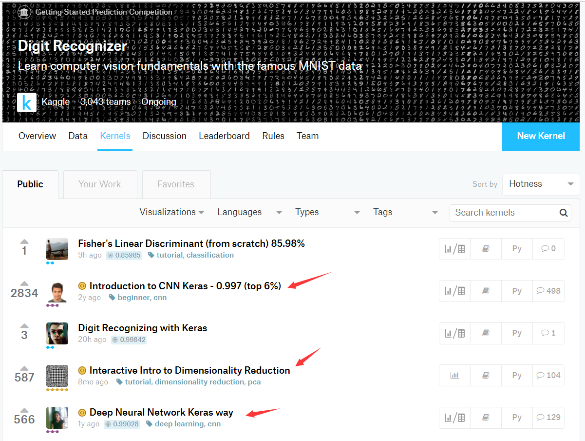
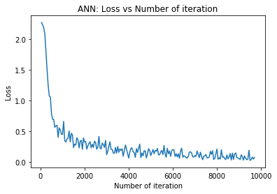
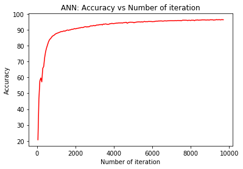

# 手把手教你如何打Kaggle(Kaggle入门比赛Digit Recognizer数字识别 Pytorch实现)

> 搜索微信公众号:‘AI-ming3526’或者’计算机视觉这件小事’ 获取更多算法、机器学习干货  
> csdn：https://blog.csdn.net/baidu_31657889/  
> github：https://github.com/aimi-cn/AILearners  

Kaggle 是一个数据科学竞赛的平台，很多公司会发布一些接近真实业务的问题，吸引爱好数据科学的人来一起解决。 

官网：https://www.kaggle.com/ 

最近正好在学习机器学习实战和Pytorch教程 然后学完之后幻想的肯定是要去打Kaggle呀(无知~) 哈哈哈 但是去Kaggle一看 一脸懵逼 然后就想做一个简单的Kaggle教程 让大家少入点坑 

**对于我们大部分来说可能没什么基础或者基础不是那么强(大家可以学习机器学习深度学习的话 可以参照我们做的笔记进行学习 [我们提供详细的AI方向笔记和源码供大家学习](https://github.com/aimi-cn/AILearners)) 刚开始就做项目打比赛的话比较有难度 不怕大家嘲笑 我也是这样的 学完机器学习、深度学习之后也没什么实战经验 但是非常想自己去做点什么** 

**在我了解kaggle之后 我发现上面的比赛中有一个模块专门是为新手准备的[链接](https://www.kaggle.com/competitions?sortBy=grouped&group=general&page=1&pageSize=20&category=gettingStarted)叫做Getting Started模块见下图 我们基础不好或者想入门的话 可以先挑战入门的项目 更重要的是这些入门项目中我们可以参加之后看其中的kernels板块 有各路大神分享的自己是怎么写的代码 我们直接可以照这这些大佬的来做 选择图中赞多的 还可以顺便学下英语 哈哈哈 一举两得 那么今天我要做的这个demo就是复现一下Kaggle 入门比赛的Getting Started 的一个手写体识别的Pytorch实现**



Kaggle 已被 Google 收购，请参阅[《谷歌收购 Kaggle 为什么会震动三界（AI、机器学习、数据科学界）》](https://www.leiphone.com/news/201703/ZjpnddCoUDr3Eh8c.html)

对于Kaggle入门 apachecn的大佬们已经录制过视频来介绍了 详见 [视频地址](https://www.bilibili.com/video/av53119200/?p=1)  
知乎上的各路大佬要给出了自己的简介 详见 [参考链接](https://www.zhihu.com/question/23987009)

官方给出的入门操作指南:  https://github.com/apachecn/kaggle/blob/master/docs/kaggle-quickstart.md

参加 kaggle 最简单的流程就是：

- 第一步：在 Data 里面下载三个数据集，最基本的就是上面提到的三个文件，有些比赛会有附加的数据描述文件等。 

- 第二步：自己在线下分析，建模，调参，把用 test 数据集预测好的结果，按照 sample_submission 的格式输出到 csv 文件中。 

-  第三步：点击蓝色按钮 ’Submit Predictions’ ，把 csv 文件拖拽进去，然后系统就会加载并检验结果，稍等片刻后就会在 Leaderboard 上显示当前结果所在的排名位置。

上传过一次结果之后，就直接加入了这场比赛。正式比赛中每个团队每天有 5 次的上传机会，然后就要等 24 小时再次传结果，playground 的是 9 次

我们看完Kaggle入门之后 我们一起来复现Digit Recognizer数字识别 也就是mnist手写体识别   

项目链接:https://www.kaggle.com/c/digit-recognizer/overview

复现的代码的地址：https://www.kaggle.com/kanncaa1/pytorch-tutorial-for-deep-learning-lovers  
https://www.kaggle.com/kanncaa1/recurrent-neural-network-with-pytorch

由于内容过多 所以我只在这里展示手写体识别的CNN网络实现 完整代码参考地址：
https://github.com/aimi-cn/AILearners/tree/master/src/py3.x/others/fm/19.05.25/kaggle.py

数据集下载地址：https://www.kaggle.com/c/digit-recognizer/data


代码：
```python
import torch
import torch.nn as nn
import torchvision.transforms as transforms
from torch.autograd import Variable
from sklearn.model_selection import train_test_split

import numpy as np # linear algebra
import pandas as pd # data processing, CSV file I/O (e.g. pd.read_csv)

import matplotlib.pyplot as plt

train = pd.read_csv("train.csv",dtype = np.float32,encoding='utf-8')
targets_numpy = train.label.values
features_numpy = train.loc[:,train.columns != "label"].values/255 # normalization
features_train, features_test, targets_train, targets_test = train_test_split(features_numpy,
                                                                             targets_numpy,
                                                                             test_size = 0.2,
                                                                             random_state = 42) 
featuresTrain = torch.from_numpy(features_train)
targetsTrain = torch.from_numpy(targets_train).type(torch.LongTensor) # data type is long

# create feature and targets tensor for test set.
featuresTest = torch.from_numpy(features_test)
targetsTest = torch.from_numpy(targets_test).type(torch.LongTensor) # data type is long


# Create CNN Model
class CNNModel(nn.Module):
    def __init__(self):
        super(CNNModel, self).__init__()
        
        # Convolution 1
        self.cnn1 = nn.Conv2d(in_channels=1, out_channels=16, kernel_size=5, stride=1, padding=0)
        self.relu1 = nn.ReLU()
        
        # Max pool 1
        self.maxpool1 = nn.MaxPool2d(kernel_size=2)
     
        # Convolution 2
        self.cnn2 = nn.Conv2d(in_channels=16, out_channels=32, kernel_size=5, stride=1, padding=0)
        self.relu2 = nn.ReLU()
        
        # Max pool 2
        self.maxpool2 = nn.MaxPool2d(kernel_size=2)
        
        # Fully connected 1
        self.fc1 = nn.Linear(32 * 4 * 4, 10) 
    
    def forward(self, x):
        # Convolution 1
        out = self.cnn1(x)
        out = self.relu1(out)
        
        # Max pool 1
        out = self.maxpool1(out)
        
        # Convolution 2 
        out = self.cnn2(out)
        out = self.relu2(out)
        
        # Max pool 2 
        out = self.maxpool2(out)
        out = out.view(out.size(0), -1)

        # Linear function (readout)
        out = self.fc1(out)
        
        return out

# batch_size, epoch and iteration
batch_size = 100
n_iters = 2500
num_epochs = n_iters / (len(features_train) / batch_size)
num_epochs = int(num_epochs)

# Pytorch train and test sets
train = torch.utils.data.TensorDataset(featuresTrain,targetsTrain)
test = torch.utils.data.TensorDataset(featuresTest,targetsTest)

# data loader
train_loader = torch.utils.data.DataLoader(train, batch_size = batch_size, shuffle = False)
test_loader = torch.utils.data.DataLoader(test, batch_size = batch_size, shuffle = False)
    
# Create ANN
model = CNNModel()

# Cross Entropy Loss 
error = nn.CrossEntropyLoss()

# SGD Optimizer
learning_rate = 0.1
optimizer = torch.optim.SGD(model.parameters(), lr=learning_rate)

# CNN model training
count = 0
loss_list = []
iteration_list = []
accuracy_list = []
for epoch in range(num_epochs):
    for i, (images, labels) in enumerate(train_loader):
        
        train = Variable(images.view(100,1,28,28))
        labels = Variable(labels)
        
        # Clear gradients
        optimizer.zero_grad()
        
        # Forward propagation
        outputs = model(train)
        
        # Calculate softmax and ross entropy loss
        loss = error(outputs, labels)
        
        # Calculating gradients
        loss.backward()
        
        # Update parameters
        optimizer.step()
        count += 1
        if count % 50 == 0:
            # Calculate Accuracy         
            correct = 0
            total = 0
            # Iterate through test dataset
            for images, labels in test_loader:
                
                test = Variable(images.view(100,1,28,28))
                
                # Forward propagation
                outputs = model(test)
                
                # Get predictions from the maximum value
                predicted = torch.max(outputs.data, 1)[1]
                
                # Total number of labels
                total += len(labels)
                
                correct += (predicted == labels).sum()
            
            accuracy = 100 * correct / float(total)
            
            # store loss and iteration
            loss_list.append(loss.data)
            iteration_list.append(count)
            accuracy_list.append(accuracy)
            if count % 500 == 0:
                # Print Loss
                print('Iteration: {}  Loss: {}  Accuracy: {} %'.format(count, loss.item(), accuracy))


# visualization loss 
plt.plot(iteration_list,loss_list)
plt.xlabel("Number of iteration")
plt.ylabel("Loss")
plt.title("CNN: Loss vs Number of iteration")
plt.show()

# visualization accuracy 
plt.plot(iteration_list,accuracy_list,color = "red")
plt.xlabel("Number of iteration")
plt.ylabel("Accuracy")
plt.title("CNN: Accuracy vs Number of iteration")
plt.show()
```

效果展示：

损失和正确率：
```
Iteration: 500  Loss: 0.7833276987075806  Accuracy: 78.63095238095238 %
Iteration: 1000  Loss: 0.4462096393108368  Accuracy: 87.5952380952381 %
Iteration: 1500  Loss: 0.23126870393753052  Accuracy: 89.38095238095238 %
Iteration: 2000  Loss: 0.3213753402233124  Accuracy: 90.54761904761905 %
Iteration: 2500  Loss: 0.31160667538642883  Accuracy: 91.91666666666667 %
Iteration: 3000  Loss: 0.11500809341669083  Accuracy: 92.52380952380952 %
Iteration: 3500  Loss: 0.24909700453281403  Accuracy: 93.46428571428571 %
Iteration: 4000  Loss: 0.0595395565032959  Accuracy: 93.91666666666667 %
Iteration: 4500  Loss: 0.2870238721370697  Accuracy: 94.45238095238095 %
Iteration: 5000  Loss: 0.10009602457284927  Accuracy: 94.71428571428571 %
Iteration: 5500  Loss: 0.18451453745365143  Accuracy: 94.85714285714286 %
Iteration: 6000  Loss: 0.1969141811132431  Accuracy: 95.08333333333333 %
Iteration: 6500  Loss: 0.09760041534900665  Accuracy: 95.5 %
Iteration: 7000  Loss: 0.1016923263669014  Accuracy: 95.72619047619048 %
Iteration: 7500  Loss: 0.11774526536464691  Accuracy: 95.70238095238095 %
Iteration: 8000  Loss: 0.2076673060655594  Accuracy: 95.83333333333333 %
Iteration: 8500  Loss: 0.04787572845816612  Accuracy: 96.13095238095238 %
Iteration: 9000  Loss: 0.05220276862382889  Accuracy: 96.21428571428571 %
Iteration: 9500  Loss: 0.02108362689614296  Accuracy: 96.36904761904762 %
```





结语：对于很多小伙伴打不开kaggle网站或者很慢的小伙伴 国内也有很多比赛项目供大家选择
天池：https://tianchi.aliyun.com/home/  
tinymind：https://www.tinymind.cn/  
flyai：https://www.flyai.com/  
这几个都是很好的比赛网站 大家可以挑选适合自己的来进行训练比赛~

AIMI-CN AI学习交流群【1015286623】 获取更多AI资料 
扫码加群：


分享技术，乐享生活：我们的公众号每周推送“AI”系列资讯类文章，欢迎您的关注！


